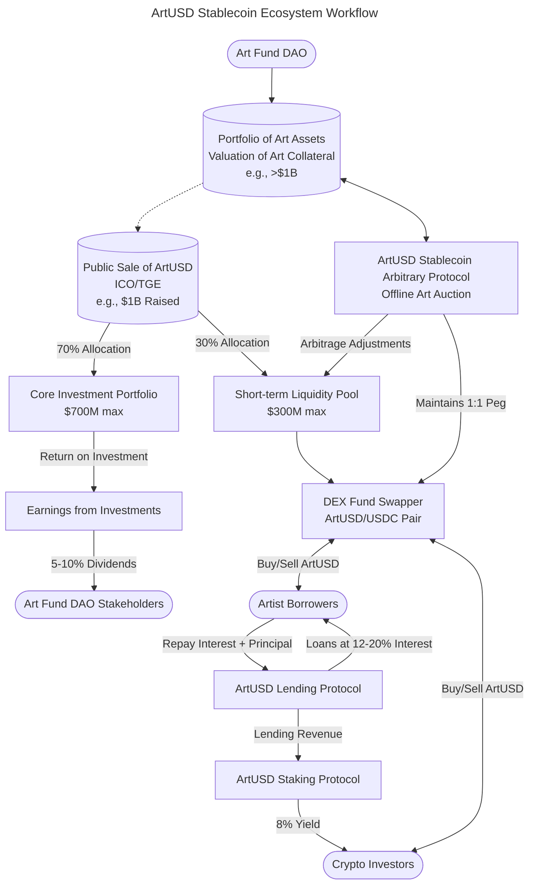
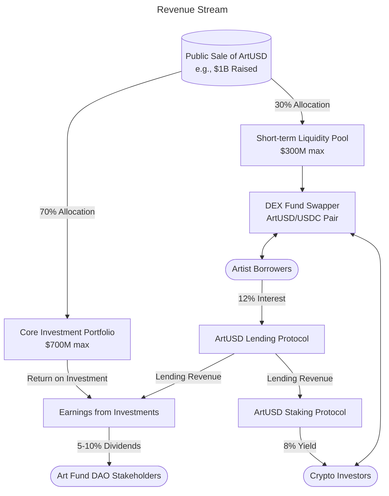
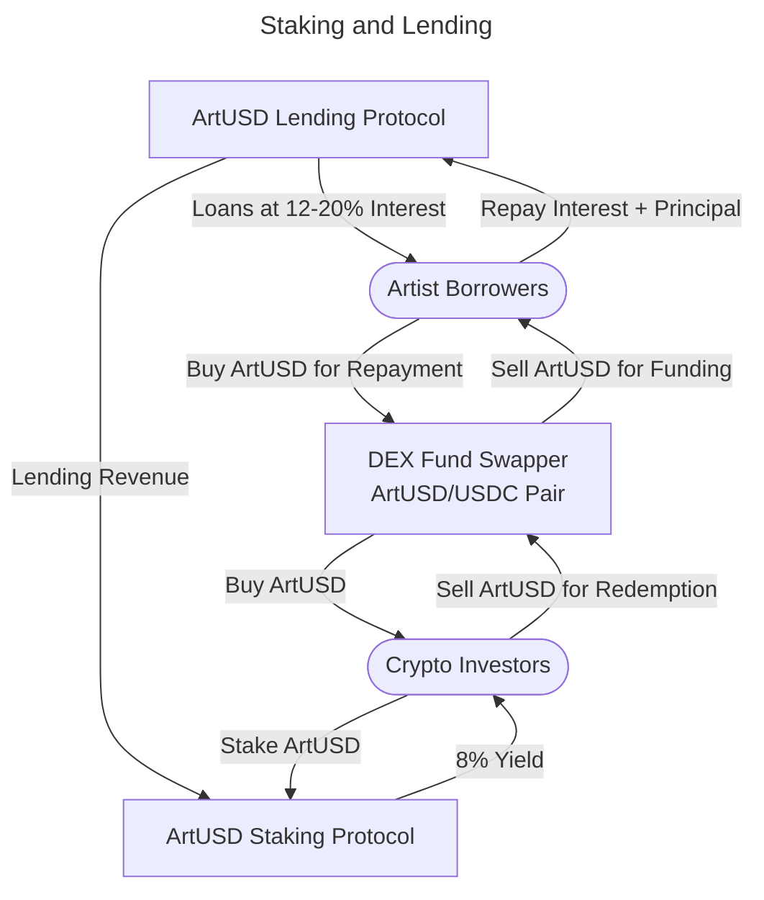

The ArtUSD stablecoin finance protocol is a decentralized finance (DeFi) system backed by art investments, designed to maintain a stable value while providing opportunities for investors, stakeholders, and artists. 

The "ArtUSD Stablecoin Ecosystem Workflow" diagram illustrates the decentralized finance (DeFi) system of ArtUSD, a stablecoin backed by a $1B art portfolio. It shows how funds from the ArtUSD public sale are allocated (70% to investments, 30% to liquidity), generating returns for DAO stakeholders (5-10% dividends) and stakers (8% yield). Artists borrow ArtUSD at 12-20% interest, repaid via a DEX (ArtUSD/USDC pair), while an arbitrage protocol maintains the 1:1 USD peg, ensuring stability and liquidity.

---

Below is an explanation of each component of the protocol:

### 1. **Art Fund DAO Stakeholders**
- **Concept**: The system is governed by a Decentralized Autonomous Organization (DAO) comprising stakeholders who hold or manage the Art Fund.
- **Collateral**: The stablecoin (ArtUSD) is backed by a portfolio of art assets valued at, for example, more than $1 billion.
- **Valuation Mechanism**: The total supply of ArtUSD is tied to the valuation of the art collateral. This ensures the stablecoin's peg (likely 1:1 with USD) is supported by tangible assets.

---

### 2. **Art Fund Management**
- **Revenue Generation**: The Art Fund generates earnings through the public sale of ArtUSD and core investment activities.
- **Dividends**: Stakeholders in the Art Fund receive dividends, estimated at 5–10% of the earnings, as a reward for their investment or governance participation.

---

### 3. **ArtUSD Stablecoin ICO**
- **Initial Coin Offering (ICO)**: ArtUSD is issued through a public sale, raising funds (e.g., $1 billion).
- **Fund Allocation**:
  - **70% ($700M max)**: Allocated to a **Core Investment Portfolio**, likely used to acquire or manage art assets to maintain or grow the collateral value.
  - **30% ($300M max)**: Allocated to a **Short-term Liquidity Pool**, ensuring liquidity for trading, redemptions, and other transactions involving ArtUSD.

---

### 4. **DEX Fund Swapper**
- **Purpose**: A decentralized exchange (DEX) facilitates trading and liquidity for ArtUSD, paired with another stablecoin like USDC (ArtUSD/USDC pair).
- **Functions**:
  - **Crypto Investors**: Can buy ArtUSD for staking (to earn yield) or sell ArtUSD to redeem funds.
  - **Artist Borrowers**: Can sell ArtUSD to raise funds or buy ArtUSD to repay loans (interest and principal).
- **Role**: Ensures market liquidity and accessibility for investors and borrowers.

---

---

### 5. **ArtUSD Staking Protocol**
- **Purpose**: Allows crypto investors to stake their ArtUSD to earn a yield.
- **Yield Source**: The yield (e.g., 8%) comes from the interest earned through the lending protocol.
- **Mechanism**: Investors lock up ArtUSD in the staking protocol to receive returns, incentivizing holding and stabilizing the system.

---

### 6. **ArtUSD Lending Protocol**
- **Purpose**: Enables emerging artists to borrow funds (in ArtUSD) to support their work or projects.
- **Interest Rates**: Loans carry interest rates ranging from 12–20%, which are higher than staking yields to ensure profitability for the protocol and stakers.
- **Use Case**: Artists borrow ArtUSD, use it for funding, and repay with interest, contributing to the system's revenue.

---

### 7. **ArtUSD Stablecoin Arbitrary Protocol**
- **Purpose**: Maintains the ArtUSD peg (likely 1:1 with USD) through arbitrage mechanisms.
- **Mechanism**: If ArtUSD deviates from its peg, market participants can exploit price differences (e.g., buying low on the DEX and redeeming high, or vice versa) to restore the peg. This could involve interactions with the liquidity pool or collateral adjustments.

### Key Notes

1. **Collateral Backing**: The $1B art portfolio underpins ArtUSD’s value, ensuring stability and trust.
2. **Revenue Flow**:
   - ArtUSD is sold to the public, raising funds.
   - Funds are split into investments (70%) and liquidity (30%).
   - Investments generate returns, which are distributed as dividends (to stakeholders) and yields (to stakers).
3. **Lending and Staking**:
   - Artists borrow ArtUSD at 12–20% interest, creating revenue.
   - Investors stake ArtUSD to earn 8% yield from lending profits.
4. **Liquidity and Pegging**:
   - The DEX ensures ArtUSD can be traded, staked, or redeemed.
   - The arbitrary protocol corrects any price deviations to maintain the peg.
5. **Governance**: The DAO oversees the system, ensuring transparency and stakeholder alignment.

---
