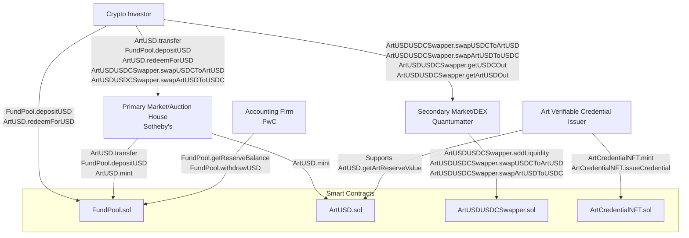

# ArtUSD Stablecoin Model White Paper
> Real Matter Technology Limited
> 
> Writer : NG Ming Lam
>
> 1 May 2025

## Table of Contents
- [Abstract](#abstract)
- [1. Introduction](#1-introduction)
- [2. Role-Centric Block Diagram](#2-role-centric-block-diagram)
- [3. System Architecture](#3-system-architecture)
- [4. Purchasing and Arbitrage Processes](#4-purchasing-and-arbitrage-processes)
- [5. Smart Contract Implementation](#5-smart-contract-implementation)
- [6. Implementation Details](#6-implementation-details)
- [7. Risks and Mitigations](#7-risks-and-mitigations)
- [8. Funding and Leverage Model](#10-funding-and-leverage-model)
- [9. Conclusion](#8-conclusion)
- [Disclaimer](#disclaimer)

## Abstract
ArtUSD is a stablecoin model pegged 1:1 to the US dollar, backed by a **$1 billion art collection** verified through NFT-based legel credentials and a regulated USD reserve pool (in USDC). Operating on Ethereum, ArtUSD leverages smart contracts to facilitate issuance, trading, redemption, and arbitrage. The system integrates a **leverage model** requiring only **$300 million USDC** in the FundPool to issue **1 billion ArtUSD**, achieving capital efficiency with a 3:1 leverage ratio. The **Primary Market/Auction House (e.g., Sotheby’s)** manages issuance and offline arbitrage, the **Secondary Market/DEX (e.g., Quantumatter)** enables trading, and the **Accounting Firm (e.g., PwC)** ensures reserve transparency.  This white paper details the system’s architecture, roles, smart contracts, purchasing/arbitrage processes, and funding model, supported by visual diagrams.

## 1. Introduction
ArtUSD introduces a novel stablecoin model that combines the stability of fiat-backed virtual assets (e.g. cryptocurrencies) with the value preservation of high-value art collections. Central to its design is a **leverage model** that optimizes capital efficiency while ensuring a robust 1:1 peg to the US dollar. By backing **1 billion ArtUSD** with a **$1 billion art collection** and a **~$300 million USDC FundPool**, ArtUSD achieves a **leverage ratio** of 3:1, requiring only ~30% liquid reserves. This model delivers key benefits:
- **Capital Efficiency**: A fractional USDC reserve reduces upfront capital needs, leveraging the $1 billion art collection as collateral, akin to issuing **perpetual redeemable bonds**.
- **Price Stability**: Online arbitrage (via Secondary Market/DEX) and offline auctions (e.g., via Sotheby’s events) correct price deviations, maintaining the 1:1 peg.
- **Trust and Transparency**: NFT verifiable credentials (`ArtCredentialNFT.sol`) verify art authenticity, oracles (`ArtUSD.getArtReserveValue`) provide accurate valuations, and audits (`FundPool.getReserveBalance`) ensure reserve integrity.
- **Market Appeal**: The bond-like structure, with each ArtUSD redeemable for $1 USDC, attracts investors seeking stability and art-backed value.   This white paper is for educational purposes only. It is not intended to provide financial, legal, or investment advice.

The ArtUSD ecosystem integrates five roles:
- **Crypto Investor**: Purchases ArtUSD, trades, and arbitrages to stabilize the peg.
- **Primary Market/Auction House (e.g., Sotheby’s)**: Issues ArtUSD, conducts auctions, and manages offline arbitrage.
- **Secondary Market/DEX (e.g., Quantumatter)**: Operates the ArtUSD/USDC automated market maker (AMM) for trading.
- **Art Verifiable Credential Issuer**: Issues NFTs to authenticate art collections.
- **Accounting Firm (e.g., PwC)**: Audits the USDC FundPool for transparency.

This white paper outlines the system’s architecture, role interactions, smart contracts, purchasing and arbitrage processes, and funding model, with diagrams to illustrate operations and the leverage structure.

## 2. Role-Centric Block Diagram
The ArtUSD system is driven by five roles, each interacting through smart contract functions across four contracts: `ArtUSD.sol`, `FundPool.sol`, `ArtUSDUSDCSwapper.sol`, and `ArtCredentialNFT.sol`. The block diagram (Figure 1) visualizes these roles as primary nodes, with arrows indicating function-based interactions.

### 2.1 Block Diagram

Figure 1: Role-Centric Block Diagram illustrating interactions between Crypto Investor, Primary Market/Auction House (Sotheby’s), Secondary Market/DEX (Quantumatter), Art Verifiable Credential Issuer, and Accounting Firm (PwC), facilitated by smart contract functions.

### 2.2 Role Functionalities
Crypto Investor:
Functions: ArtUSD.transfer (purchasing), ArtUSDUSDCSwapper.swapUSDCToArtUSD/swapArtUSDToUSDC (trading), FundPool.depositUSD (minting), ArtUSD.redeemForUSD (redemption).

Purpose: Buys ArtUSD, trades, and arbitrages to maintain the peg.

Primary Market/Auction House (Sotheby’s):
Functions: ArtUSD.mint (issuance), ArtUSD.transfer (distribution), FundPool.depositUSD (auction proceeds).

Purpose: Manages issuance, auctions, and offline arbitrage.

Secondary Market/DEX (Quantumatter):
Functions: ArtUSDUSDCSwapper.addLiquidity, swapUSDCToArtUSD, swapArtUSDToUSDC, getUSDCOut, getArtUSDOut.

Purpose: Operates the AMM for trading and arbitrage.

Art Verifiable Credential Issuer:
Functions: ArtCredentialNFT.mint, issueCredential.

Purpose: Verifies art collections, supporting ArtUSD.getArtReserveValue.

Accounting Firm (PwC):
Functions: FundPool.getReserveBalance, withdrawUSD.

Purpose: Audits reserves for transparency.

### 2.3 Diagram Explanation
Crypto Investor  Primary Market/Auction House: Purchasing via auctions (ArtUSD.transfer, FundPool.depositUSD).

Crypto Investor  Secondary Market/DEX: Trading and arbitrage (swapUSDCToArtUSD, swapArtUSDToUSDC).

Primary Market/Auction House  FundPool: Depositing proceeds (depositUSD, mint).

Secondary Market/DEX  Swapper: Managing AMM liquidity (addLiquidity, swap).

Art Verifiable Credential Issuer  ArtUSD: Supporting valuation (issueCredential, getArtReserveValue).

Accounting Firm  FundPool: Auditing reserves (getReserveBalance).

## 3. System Architecture
ArtUSD’s architecture comprises four smart contracts to support issuance, redemption, trading, and art verification.

### 3.1 ArtUSD.sol
Purpose: Manages ArtUSD issuance, transfers, redemption, and burning (ERC-20).

Key Functions:
transfer(to, amount): Transfers ArtUSD.

mint(to, amount): Issues ArtUSD (called by FundPool.depositUSD).

redeemForUSD(amount): Redeems ArtUSD for USDC at 1:1.

getArtReserveValue(): Retrieves art value via Chainlink oracle.

pause()/unpause(): Emergency controls.

### 3.2 FundPool.sol
Purpose: Manages USDC reserves, audited by PwC.

Key Functions:
depositUSD(amount): Accepts USDC, triggers minting.

releaseUSD(to, amount): Releases USDC for redemptions.

getReserveBalance(): Provides reserve transparency.

withdrawUSD(amount): Owner-managed adjustments.

### 3.3 ArtUSDUSDCSwapper.sol
Purpose: Enables trading via a Uniswap V2-inspired AMM.

Key Functions:
addLiquidity(artUSDAmount, usdcAmount): Initializes the pool.

swapUSDCToArtUSD(usdcIn): Buys ArtUSD.

swapArtUSDToUSDC(artUSDIn): Sells ArtUSD.

getUSDCOut(artUSDIn) / getArtUSDOut(usdcIn): Calculates trade outputs.

### 3.4 ArtCredentialNFT.sol
Purpose: Issues ERC-721 NFTs as art credentials.

Key Functions:
mint(to): Creates NFTs.

issueCredential(to, details): Issues credentials with art details.

## 4. Purchasing and Arbitrage Processes
ArtUSD supports purchasing in the primary market and arbitrage (online/offline) to maintain the 1:1 peg.

### 4.1 Purchasing Process
Managed by Sotheby’s, with Crypto Investors as buyers:
Auction Event ("Potato Event"):
Role: Primary Market/Auction House.

Action: Sotheby’s auctions art verified by ArtCredentialNFT.issueCredential.

Outcome: Investors bid in USDC.

Deposit Proceeds:
Function: FundPool.depositUSD(amount) → ArtUSD.mint(to, amount).

Outcome: ArtUSD minted.

Distribute ArtUSD:
Function: ArtUSD.transfer(to, amount).

Outcome: Investors receive ArtUSD.

Audit:
Role: Accounting Firm (PwC).

Function: FundPool.getReserveBalance().

Example:
Sotheby’s raises 1M USDC, deposits via FundPool.depositUSD(1M), mints 1M ArtUSD, and transfers to an investor (ArtUSD.transfer).

### 4.2 Arbitrage Process

#### 4.2.1 Online Arbitrage
Below $1 (0.95 USDC/ArtUSD):
Price Check: ArtUSDUSDCSwapper.getArtUSDOut(1,000 USDC) → 0.95 (reserves: 10,526,316 ArtUSD, 10,000,000 USDC).

Buy ArtUSD: swapUSDCToArtUSD(1,000 USDC) → 10,494.74 ArtUSD.

Redeem USDC: redeemForUSD(10,494.74) → 10,494.74 USDC.

Profit: 9,494.69 USDC (after 0.3% fee + 0.05 USDC gas).

Audit: PwC verifies reserves (getReserveBalance).

Above $1 (1.05 USDC/ArtUSD):
Price Check: getUSDCOut(1,000 ArtUSD) → 1.05 (reserves: 9,523,809 ArtUSD, 10,000,000 USDC).

Deposit USDC: depositUSD(1,000) → 1,000 ArtUSD.

Sell ArtUSD: swapArtUSDToUSDC(1,000) → 1,047.12 USDC.

Profit: 47.07 USDC.

Audit: PwC verifies reserves.

#### 4.2.2 Offline Arbitrage
Role: Primary Market/Auction House.

Action: Sotheby’s auctions art to address price deviations, depositing proceeds (FundPool.depositUSD → ArtUSD.mint).

Example: Price at 0.90 USDC/ArtUSD; Sotheby’s auctions $250M art, deposits 250M USDC, mints 250M ArtUSD, stabilizing the peg.

## 5. Smart Contract Implementation

### 5.1 ArtUSD.sol
solidity

// SPDX-License-Identifier: MIT
pragma solidity ^0.8.0;

import "@openzeppelin/contracts/token/ERC20/ERC20.sol";
import "@openzeppelin/contracts/access/Ownable.sol";
import "@chainlink/contracts/src/v0.8/interfaces/AggregatorV3Interface.sol";

contract ArtUSD is ERC20, Ownable {
    AggregatorV3Interface public artPriceFeed;
    address public fundPool;
    bool public paused;

    event Redeemed(address indexed user, uint256 amount, string assetType);

    constructor(address _artPriceFeed, address _fundPool) ERC20("ArtUSD", "AUSD") {
        artPriceFeed = AggregatorV3Interface(_artPriceFeed);
        fundPool = _fundPool;
        paused = false;
    }

    modifier whenNotPaused() {
        require(!paused, "Contract is paused");
        _;
    }

    function mint(address to, uint256 amount) external onlyOwner whenNotPaused {
        require(getArtReserveValue() >= totalSupply() + amount, "Insufficient art collection reserve");
        _mint(to, amount);
    }

    function redeemForUSD(uint256 amount) external whenNotPaused {
        require(balanceOf(msg.sender) >= amount, "Insufficient balance");
        _burn(msg.sender, amount);
        (bool success, ) = fundPool.call(abi.encodeWithSignature("releaseUSD(address,uint256)", msg.sender, amount));
        require(success, "USD redemption failed");
        emit Redeemed(msg.sender, amount, "USDC");
    }

    function getArtReserveValue() public view returns (uint256) {
        (, int256 price, , , ) = artPriceFeed.latestRoundData();
        require(price > 0, "Invalid price feed");
        return uint256(price);
    }

    function pause() external onlyOwner {
        paused = true;
    }

    function unpause() external onlyOwner {
        paused = false;
    }
}

### 5.2 FundPool.sol
solidity

// SPDX-License-Identifier: MIT
pragma solidity ^0.8.0;

import "@openzeppelin/contracts/token/ERC20/IERC20.sol";
import "@openzeppelin/contracts/access/Ownable.sol";

contract FundPool is Ownable {
    IERC20 public usdc;
    address public artUSD;
    uint256 public totalReserve;

    event USDDeposited(address indexed user, uint256 amount);
    event USDReleased(address indexed user, uint256 amount);

    constructor(address _usdc, address _artUSD) {
        usdc = IERC20(_usdc);
        artUSD = _artUSD;
        totalReserve = 0;
    }

    function depositUSD(uint256 amount) external {
        require(usdc.transferFrom(msg.sender, address(this), amount), "USDC transfer failed");
        totalReserve += amount;
        (bool success, ) = artUSD.call(abi.encodeWithSignature("mint(address,uint256)", msg.sender, amount));
        require(success, "ArtUSD mint failed");
        emit USDDeposited(msg.sender, amount);
    }

    function releaseUSD(address to, uint256 amount) external {
        require(msg.sender == artUSD, "Only ArtUSD contract can call");
        require(totalReserve >= amount, "Insufficient reserve");
        require(usdc.transfer(to, amount), "USDC transfer failed");
        totalReserve -= amount;
        emit USDReleased(to, amount);
    }

    function getReserveBalance() external view returns (uint256) {
        return totalReserve;
    }

    function withdrawUSD(uint256 amount) external onlyOwner {
        require(totalReserve >= amount, "Insufficient reserve");
        require(usdc.transfer(owner(), amount), "USDC transfer failed");
        totalReserve -= amount;
    }
}

### 5.3 ArtUSDUSDCSwapper.sol
solidity

// SPDX-License-Identifier: MIT
pragma solidity ^0.8.0;

import "@openzeppelin/contracts/token/ERC20/IERC20.sol";
import "@openzeppelin/contracts/access/Ownable.sol";

contract ArtUSDUSDCSwapper is Ownable {
    IERC20 public artUSD;
    IERC20 public usdc;
    uint256 public reserveArtUSD;
    uint256 public reserveUSDC;
    uint256 constant public FEE = 3;

    event LiquidityAdded(address indexed provider, uint256 artUSDAmount, uint256 usdcAmount);
    event Swap(address indexed user, uint256 artUSDIn, uint256 usdcOut, uint256 usdcIn, uint256 artUSDOut);

    constructor(address _artUSD, address _usdc) {
        artUSD = IERC20(_artUSD);
        usdc = IERC20(_usdc);
    }

    function addLiquidity(uint256 artUSDAmount, uint256 usdcAmount) external {
        require(artUSD.transferFrom(msg.sender, address(this), artUSDAmount), "ArtUSD transfer failed");
        require(usdc.transferFrom(msg.sender, address(this), usdcAmount), "USDC transfer failed");
        reserveArtUSD += artUSDAmount;
        reserveUSDC += usdcAmount;
        emit LiquidityAdded(msg.sender, artUSDAmount, usdcAmount);
    }

    function removeLiquidity(uint256 artUSDAmount, uint256 usdcAmount) external onlyOwner {
        require(reserveArtUSD >= artUSDAmount && reserveUSDC >= usdcAmount, "Insufficient reserves");
        require(artUSD.transfer(msg.sender, artUSDAmount), "ArtUSD transfer failed");
        require(usdc.transfer(msg.sender, usdcAmount), "USDC transfer failed");
        reserveArtUSD -= artUSDAmount;
        reserveUSDC -= usdcAmount;
    }

    function swapArtUSDToUSDC(uint256 artUSDIn) external returns (uint256) {
        require(artUSDIn > 0, "Invalid input amount");
        require(artUSD.transferFrom(msg.sender, address(this), artUSDIn), "ArtUSD transfer failed");
        uint256 usdcOut = getUSDCOut(artUSDIn);
        require(reserveUSDC >= usdcOut, "Insufficient USDC reserve");
        require(usdc.transfer(msg.sender, usdcOut), "USDC transfer failed");
        reserveArtUSD += artUSDIn;
        reserveUSDC -= usdcOut;
        emit Swap(msg.sender, artUSDIn, usdcOut, 0, 0);
        return usdcOut;
    }

    function swapUSDCToArtUSD(uint256 usdcIn) external returns (uint256) {
        require(usdcIn > 0, "Invalid input amount");
        require(usdc.transferFrom(msg.sender, address(this), usdcIn), "USDC transfer failed");
        uint256 artUSDOut = getArtUSDOut(usdcIn);
        require(reserveArtUSD >= artUSDOut, "Insufficient ArtUSD reserve");
        require(artUSD.transfer(msg.sender, artUSDOut), "ArtUSD transfer failed");
        reserveUSDC += usdcIn;
        reserveArtUSD -= artUSDOut;
        emit Swap(msg.sender, 0, 0, usdcIn, artUSDOut);
        return artUSDOut;
    }

    function getUSDCOut(uint256 artUSDIn) public view returns (uint256) {
        require(artUSDIn > 0 && reserveArtUSD > 0 && reserveUSDC > 0, "Invalid reserves");
        uint256 artUSDInWithFee = artUSDIn * (1000 - FEE);
        return (artUSDInWithFee * reserveUSDC) / (reserveArtUSD * 1000 + artUSDInWithFee);
    }

    function getArtUSDOut(uint256 usdcIn) public view returns (uint256) {
        require(usdcIn > 0 && reserveArtUSD > 0 && reserveUSDC > 0, "Invalid reserves");
        uint256 usdcInWithFee = usdcIn * (1000 - FEE);
        return (usdcInWithFee * reserveArtUSD) / (reserveUSDC * 1000 + usdcInWithFee);
    }
}

### 5.4 ArtCredentialNFT.sol
solidity

// SPDX-License-Identifier: MIT
pragma solidity ^0.8.0;

import "@openzeppelin/contracts/token/ERC721/ERC721.sol";
import "@openzeppelin/contracts/access/Ownable.sol";

contract ArtCredentialNFT is ERC721, Ownable {
    uint256 public tokenIdCounter;
    mapping(uint256 => string) public artDetails;

    event CredentialIssued(address indexed to, uint256 tokenId, string artDetails);

    constructor() ERC721("ArtCredentialNFT", "ACN") {
        tokenIdCounter = 0;
    }

    function mint(address to) external onlyOwner {
        _safeMint(to, tokenIdCounter);
        tokenIdCounter++;
    }

    function issueCredential(address to, string memory details) external onlyOwner {
        _safeMint(to, tokenIdCounter);
        artDetails[tokenIdCounter] = details;
        emit CredentialIssued(to, tokenIdCounter, details);
        tokenIdCounter++;
    }
}

## 6. Implementation Details

Blockchain: Ethereum or Polygon for low gas fees.

Standards: ERC-20 (ArtUSD), ERC-721 (ArtCredentialNFT), Uniswap V2-inspired AMM.

Oracles: Chainlink for art valuation.

Security: Certik audits, OpenZeppelin libraries, Gnosis Safe for reserves.

Transparency: PwC audits, public reserve data via FundPool.getReserveBalance.

## 7. Risks and Mitigations
Reserve Depletion: Daily redemption caps, auction proceeds.

Smart Contract Vulnerabilities: Audits, secure libraries.

Gas Fees: Layer 2 deployment.

Art Illiquidity: Frequent auctions, NFT credentials.

Regulatory Risks: AML/KYC compliance via Sotheby’s and PwC.

## 8. Funding and Leverage Model

This section outlines the funding requirements and leverage structure for issuing 1 billion ArtUSD backed by a $1 billion art collection, conceptualized as perpetual redeemable bonds.

### 8.1 FundPool Requirements
Issuing 1 billion ArtUSD requires a FundPool of $300-500 million USDC (30-50% reserve ratio):
Daily Operations: $200M for 20% redemptions (ArtUSD.redeemForUSD), $50M for Swapper liquidity (ArtUSDUSDCSwapper.addLiquidity), $50M buffer.

Stress Case: $500M for 50% redemptions.

Art Liquidation: Sotheby’s auctions replenish USDC via FundPool.depositUSD.

Full Backing: $1B USDC ensures 100% redeemability but reduces art’s role.

### 8.2 Bond Analogy
ArtUSD resembles perpetual redeemable bonds:
Bond Value: 1 ArtUSD = $1 USDC (redeemForUSD).

Collateral: $1B art collection (ArtCredentialNFT.issueCredential).

Leverage Ratio:
$300M USDC: ($1B art + $300M) / $300M = 4.33:1.

$500M USDC: ($1B + $500M) / $500M = 3:1.

Stability: Arbitrage (swapUSDCToArtUSD, swapArtUSDToUSDC) and auctions (depositUSD).

### 8.3 Visual Diagram
mermaid

graph TD
    A[Art Collection $1B Verified by ArtCredentialNFT.issueCredential Valued by ArtUSD.getArtReserveValue] -->|Collateral Backing| B[Issued ArtUSD 1B Tokens ArtUSD.mint ArtUSD.redeemForUSD]
    A -->|Liquidation via Auctions| C[FundPool $300-500M USDC FundPool.depositUSD FundPool.releaseUSD Audited by FundPool.getReserveBalance]
    
    B -->|Redemptions| C
    B -->|Trading/Arbitrage| D[Swapper Liquidity 50M ArtUSD + 50M USDC ArtUSDUSDCSwapper.addLiquidity ArtUSDUSDCSwapper.swapUSDCToArtUSD ArtUSDUSDCSwapper.swapArtUSDToUSDC]
    
    C -->|Funds Swapper| D
    C -->|Leverage Ratio 4.33:1 ($300M) 3:1 ($500M)| B
    
    subgraph Roles
        E[Primary Market/Auction House Sotheby's] -->|Deposits Auction Proceeds FundPool.depositUSD| C
        F[Crypto Investor] -->|Trades swapUSDCToArtUSD swapArtUSDToUSDC| D
        F -->|Deposits/Redeems depositUSD redeemForUSD| C
        G[Accounting Firm PwC] -->|Audits getReserveBalance| C
        H[Art Verifiable Credential Issuer] -->|Issues Credentials issueCredential| A
    end
    
    subgraph Smart Contracts
        I[ArtUSD.sol]
        J[FundPool.sol]
        K[ArtUSDUSDCSwapper.sol]
        L[ArtCredentialNFT.sol]
    end

[^Figure 2]: Funding and Leverage Model Diagram, showing the $1 billion art collection, $300-500 million USDC FundPool, 1 billion ArtUSD, and leverage ratios (4.33:1 or 3:1). Roles interact via smart contract functions to support issuance, redemption, trading, and auditing.

### 8.4 Example Scenario
Setup:
Art Collection: $1B, verified by ArtCredentialNFT.issueCredential.

FundPool: $300M USDC (4.33:1 leverage).

Issued ArtUSD: 1B tokens (ArtUSD.mint).

Swapper: 50M ArtUSD + 50M USDC (ArtUSDUSDCSwapper.addLiquidity).

Operations:
Redemption: 20% daily demand (200M ArtUSD) requires 200M USDC (redeemForUSD), covered by FundPool.

Arbitrage:
Below $1 (0.95 USDC/ArtUSD): Buy 10,494.74 ArtUSD for 1,000 USDC (swapUSDCToArtUSD), redeem for 10,494.74 USDC, profit 9,494.69 USDC.

Above $1 (1.05 USDC/ArtUSD): Deposit 1,000 USDC (depositUSD), mint 1,000 ArtUSD, sell for 1,047.12 USDC (swapArtUSDToUSDC), profit 47.07 USDC.

Offline: Sotheby’s auctions $250M art, deposits 250M USDC (depositUSD).

Audit: PwC verifies reserves (getReserveBalance).

### 8.5 Risks and Mitigations
Art Illiquidity: Redemption caps (10%), frequent auctions.

Valuation Volatility: Chainlink oracles, conservative issuance (80% of art value).

Reserve Depletion: $500M FundPool, auction proceeds.

Regulatory Scrutiny: PwC audits, AML/KYC via Sotheby’s.

## 9. Conclusion
ArtUSD delivers a stablecoin backed by a $1 billion art collection and ~$300 million USDC, leveraging a 3:1 ratio for capital efficiency. The role-centric ecosystem, with Sotheby’s issuing, Quantumatter trading, and PwC auditing, ensures stability and trust. NFT credentials and arbitrage mechanisms enhance reliability, positioning ArtUSD for adoption in DeFi and art auction markets.

#### Future Work
- Deploy on Permissioned Hyperledger Besu for cost efficiency.
- Develop a DApp integrating auctions and trading.
- Incentivize Swapper liquidity via fee sharing.
- Partner with PQC platforms for quantum-safe integration

## Disclaimer
[^1]: This white paper is for educational purposes only. It is not intended to provide financial, legal, or investment advice, nor does it constitute an offer to sell or a solicitation to buy any securities or tokens. The concepts, mechanisms, and smart contracts described are hypothetical and intended for illustrative purposes. Readers should conduct their own research and consult with qualified professionals before making any financial decisions.

