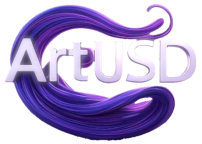

# ArtUSD Stablecoin Model White Paper
> Real Matter Technology Limited
> 
> Author: NG Ming Lam
>
> Date: 1 May 2025

## Table of Contents
- [Abstract](#abstract)
1. [Introduction](#1-introduction)
2. [Role-Centric Market Model](#2-role-centric-market-model)
3. [System Architecture](#3-system-architecture)
4. [Purchasing and Arbitrage Processes](#4-purchasing-and-arbitrage-processes)
5. [Smart Contract Implementation](#5-smart-contract-implementation)
6. [Funding and Leverage Model](#6-funding-and-leverage-model)
7. [Implementation Details](#7-implementation-details)
8. [Risks and Mitigations](#8-risks-and-mitigations)
9. [Conclusion](#9-conclusion)
- [Future Work](#future-work)
- [Disclaimer](#disclaimer)

---
## Abstract

ArtUSD is a stablecoin model pegged 1:1 to the US dollar, backed by a **$1 billion art collection** verified through NFT-based legel credentials and a regulated USD reserve pool (in USDC). Operating on Ethereum, ArtUSD leverages smart contracts to facilitate issuance, trading, redemption, and arbitrage.   
   
The system integrates a **reference leverage model** requiring, for example, only **$300 million USDC** in the FundPool to issue **1 billion ArtUSD**, achieving capital efficiency with a 4.33:1 leverage ratio. The **Primary Market/Auction House (e.g., Sotheby’s)** manages issuance and offline arbitrage, the **Secondary Market/DEX (e.g., Quantumatter)** enables trading and onchain arbitrage, and the **Auditor (e.g., PwC)** ensures reserve transparency.   
   
This white paper details the system’s architecture, market roles, smart contracts, purchasing/arbitrage processes, and funding model, supported by visual diagrams. This paper is for educational purposes only. It is not intended to provide financial, legal, or investment advice.  

---
## 1. Introduction

ArtUSD introduces a novel stablecoin model that combines the stability of fiat-backed virtual assets (e.g. cryptocurrencies) with the value preservation of high-value art collections. Central to its design is   
- a **reference leverage model** that optimizes capital efficiency while ensuring a robust 1:1 peg to the US dollar.   
- for example, by backing **1 billion ArtUSD**   
- with a **$1 billion art collection**   
- and a **~$300 million USDC FundPool**,   
ArtUSD achieves a **leverage ratio** of 4.33:1, requiring only ~30% liquid reserves.   

This model delivers key benefits:   
- **Capital Efficiency**:   
  A fractional USDC reserve reduces upfront capital needs, leveraging the $1 billion art collection as collateral, akin to issuing **perpetual redeemable bonds**.   
- **Price Stability**:   
  Onchain arbitrage (via Secondary Market/DEX) and offline auctions (e.g., via Sotheby’s events) correct price deviations, maintaining the 1:1 peg.   
- **Trust and Transparency**:   
  NFT verifiable credentials (`ArtCredentialNFT.sol`) verify art authenticity, price oracles (`ArtUSD.getArtReserveValue`) provide accurate valuations, and audits (`FundPool.getReserveBalance`) ensure reserve integrity.   
- **Market Appeal**:   
  The bond-like structure, with each ArtUSD redeemable for $1 USDC, attracts investors seeking stability and art-backed value.    

The ArtUSD ecosystem integrates five market roles:   
- **Crypto Investor**:   
  Purchases ArtUSD, trades, and arbitrages to stabilize the peg.   
- **Primary Market | Auction House (e.g., Sotheby’s)**:   
  Issues ArtUSD, conducts auctions, and manages offline arbitrage.   
- **Secondary Market | DEX (e.g., Quantumatter)**:   
  Operates the ArtUSD/USDC automated market maker (AMM) for trading.   
- **Art Credential Issuer (e.g., Sotheby’s)**:   
  Issues verifiable NFTs to authenticate art collections.   
- **Auditor (e.g., PwC)**:   
  Audits the USDC FundPool for transparency.   

This white paper outlines the system’s architecture, market role interactions, smart contracts, purchasing and arbitrage processes, and funding model, with diagrams to illustrate operations and the leverage structure.

<!----->


> Figure 1: The flowchart illustrates the stablecoin system backed by real-world art assets, structured across three sections: Primary Market (involving investors, stablecoin minting, and fund management by the auction house), Real World Assets (collateralized art collection, valuation, and liquidation), and Secondary Market (trading and arbitrage through DEX/swappers, with audit trails for transparency).   
> <a href="Mermaid Fig 1.png" target="_blank">Click to view the figure</a>

---
## 2. Role-Centric Market Model

The ArtUSD system is driven by five market roles, each interacting through smart contract functions across four contracts: `ArtUSD.sol`, `FundPool.sol`, `ArtUSDUSDCSwapper.sol`, and `ArtCredentialNFT.sol`. The block diagram (Fig. 2) visualizes these roles as primary nodes, with arrows indicating function-based interactions.

### 2.1  Block Diagram


> Figure 2: Role-Centric Market Model illustrating interactions between Crypto Investor, Primary Market/Auction House, Secondary Market/DEX, Art Credential Issuer, and Auditor, facilitated by smart contract functions.

### 2.2 Market Role Functionalities

Crypto Investor:   
- Buys ArtUSD, trades, and arbitrages to maintain the peg.   
`ArtUSD.transfer` (purchasing),   
`ArtUSDUSDCSwapper.swapUSDCToArtUSD/swapArtUSDToUSDC` (trading),   
`FundPool.depositUSD` (minting),   
`ArtUSD.redeemForUSD` (redemption).   

Primary Market | Auction House (e.g., Sotheby’s):   
- Manages onchain issuance, offchain auctions, and offline arbitrage.   
`ArtUSD.mint` (issuance),   
`ArtUSD.transfer` (distribution),   
`FundPool.depositUSD` (offchain auction proceeds).   

Secondary Market | DEX (e.g., Quantumatter):   
- Operates the AMM for trading and onchain arbitrage   
`ArtUSDUSDCSwapper.addLiquidity`,   
`swapUSDCToArtUSD`,   
`swapArtUSDToUSDC`,   
`getUSDCOut`,   
`getArtUSDOut`.   

Art Credential Issuer (e.g., Sotheby’s):   
- Verifies art collections, supporting ArtUSD.getArtReserveValue.   
`ArtCredentialNFT.mint`,   
`issueCredential`.   

Auditor (e.g., PwC):
- Audits reserves for transparency.   
`FundPool.getReserveBalance`,   
`withdrawUSD`.   

### 2.3 Diagram Explanation

Crypto Investor :left_right_arrow: Primary Market/Auction House:   
- Purchasing via auctions   
`ArtUSD.transfer`,   
`FundPool.depositUSD`.   

Crypto Investor :left_right_arrow: Secondary Market/DEX:   
- Trading and arbitrage   
`swapUSDCToArtUSD`,   
`swapArtUSDToUSDC`.   

Primary Market | Auction House :left_right_arrow: FundPool:   
- Depositing proceeds   
`depositUSD`,    
`mint`.   

Secondary Market | DEX :left_right_arrow: Swapper:   
- Managing AMM liquidity   
`addLiquidity`,   
`swap`.   

Art Credential Issuer :left_right_arrow: ArtUSD:   
- Supporting valuation   
`issueCredential`,   
`getArtReserveValue`.   

Auditor :left_right_arrow: FundPool:   
- Auditing reserves   
`getReserveBalance`.   

---
## 3. System Architecture   

ArtUSD’s architecture comprises four smart contracts to support issuance, redemption, trading, and art verification.

### 3.1 ArtUSD.sol

- Purpose: Manages ArtUSD issuance, transfers, redemption, and burning (ERC-20).   
- Key Functions:   
`transfer(to, amount)`: Transfers ArtUSD.   
`mint(to, amount)`: Issues ArtUSD (called by FundPool.depositUSD).   
`redeemForUSD(amount)`: Redeems ArtUSD for USDC at 1:1.   
`getArtReserveValue()`: Retrieves art value via price oracle (e.g., via chainlink).   
`pause()/unpause()`: Emergency controls.   

### 3.2 FundPool.sol

- Purpose: Manages USDC reserves, audited by PwC.   
- Key Functions:   
`depositUSD(amount)`: Accepts USDC, triggers minting.   
`releaseUSD(to, amount)`: Releases USDC for redemptions.   
`getReserveBalance()`: Provides reserve transparency.   
`withdrawUSD(amount)`: Owner-managed adjustments.   

### 3.3 ArtUSDUSDCSwapper.sol

- Purpose: Enables trading via a Uniswap V2-inspired AMM.   
- Key Functions:   
`addLiquidity(artUSDAmount, usdcAmount)`: Initializes the pool.   
`swapUSDCToArtUSD(usdcIn)`: Buys ArtUSD.   
`swapArtUSDToUSDC(artUSDIn)`: Sells ArtUSD.   
`getUSDCOut(artUSDIn) / getArtUSDOut(usdcIn)`: Calculates trade outputs.   

### 3.4 ArtCredentialNFT.sol

- Purpose: Issues ERC-721 NFTs as art credentials.   
- Key Functions:   
`mint(to)`: Creates NFTs.   
`issueCredential(to, details)`: Issues credentials with art details.   

---
## 4. Purchasing and Arbitrage Processes

ArtUSD supports purchasing in the primary market and onchain arbitrage to maintain the 1:1 peg.

### 4.1 Purchasing Process
Managed by Aucion House (e.g., Sotheby’s), with Crypto Investors as buyers:   

- Auction Event:   
    - Role: Primary Market.
    - Action: auctions art verified by `ArtCredentialNFT.issueCredential`.   
    - Outcome: Investors bid the NFT Credentials in USDC.   
- Deposit Proceeds:   
    - Function: `FundPool.depositUSD(amount)` → `ArtUSD.mint(to, amount)`.   
    - Outcome: ArtUSD minted.   
- Distribute ArtUSD:   
    - Function: `ArtUSD.transfer(to, amount)`.   
    - Outcome: Investors receive ArtUSD.   
- Audit:   
    - Role: Auditor.   
    - Function: `FundPool.getReserveBalance()`.   

Example:   
- Sotheby’s raises 1M USDC,
    - deposits via `FundPool.depositUSD(1M)`,
    - mints 1M `ArtUSD`, and
    - transfers to crypto investors (`ArtUSD.transfer`).   

### 4.2 Arbitrage Process   

#### 4.2.1 Short-Term Onchain Arbitrage   

Role: DEX.   
<br>
:arrow_heading_down: Below $1 (0.95 USDC/ArtUSD):
- Price Check:   
  `ArtUSDUSDCSwapper.getArtUSDOut(1,000 USDC)` → 0.95 (reserves: 10,526,316 ArtUSD, 10,000,000 USDC).   
- Buy ArtUSD:   
  `swapUSDCToArtUSD(1,000 USDC)` → ~10,484 ArtUSD.
- Redeem USDC:   
  `redeemForUSD(10,494.74)` → 10,484 USDC.   
- Profit:   
  ~484 USDC (before fees).   
- Audit:   
  PwC verifies reserves (`getReserveBalance`).   

:arrow_heading_up: Above $1 (1.05 USDC/ArtUSD):   
- Price Check:   
  `getUSDCOut(1,000 ArtUSD)` → 1.05 (reserves: 9,523,809 ArtUSD, 10,000,000 USDC).     
- Deposit USDC:   
  `depositUSD(1,000)` → 1,000 ArtUSD.   
- Sell ArtUSD:   
  `swapArtUSDToUSDC(1,000)` → 1,047.12 USDC.   
- Profit:   
  47.07 USDC.   
- Audit:   
  PwC verifies reserves.

:twisted_rightwards_arrows: Price Calculation  
The Swapper uses a constant product formula (x * y = k):   
- Buy ArtUSD:   
```
artUSDOut = (usdcIn * 997 * reserveArtUSD) / (reserveUSDC * 1000 + usdcIn * 997)
```
- Sell ArtUSD:   
```
usdcOut = (artUSDIn * 997 * reserveUSDC) / (reserveArtUSD * 1000 + artUSDIn * 997)
```
Minimum deviation: ~0.8% (0.3% fee + gas, e.g., 0.05 USDC).  

#### 4.2.2 Long-Term Offline Arbitrage   

Role: Auction House.  
- Action: auctions art to address price deviations,  
- depositing proceeds   
  `FundPool.depositUSD` → `ArtUSD.mint`.   
- Example:   
  Price at 0.90 `USDC/ArtUSD`; auctions $250M art, deposits 250M `USDC`, mints 250M `ArtUSD`, stabilizing the peg.

#### 4.2.3 Short-Term vs. Long-Term Arbitrage for ArtUSD   

| Aspect                | Short-Term OnChain Arbitrage                                                                              | Long-Term Offline Arbitrage                                                                               |
|-----------------------|-----------------------------------------------------------------------------------------------------------|-----------------------------------------------------------------------------------------------------------|
| **Objective**         | Fix small price swings (e.g., 0.95-1.05 USDC/ArtUSD) daily.                                               | Correct major or persistent price deviations for long-term stability.                                      |
| **Time Frame**        | Seconds to minutes.                                                                                       | Days to weeks.                                                                                            |
| **Participants**      | Crypto Investors.                                                                                         | Primary Market/Auction House, with Crypto Investors.                                                      |
| **Method**            | Onchain AMM trades via Secondary Market/DEX.                                                              | Offline art auctions + online supply adjustments.                                                         |
| **Capital Needs**     | Low (hundreds to thousands of USDC).                                                                      | High (millions to hundreds of millions of USDC).                                                          |
| **Smart Contracts**   | `swapUSDCToArtUSD`, `swapArtUSDToUSDC`, `depositUSD`, `redeemForUSD`                                      | `depositUSD`, `mint`, `addLiquidity`, `transfer`                                                          |
| **Impact**            | Stabilizes daily prices, boosts AMM liquidity.                                                            | Restores market confidence, balances leverage (4.33:1).                                                   |
| **Risks**             | Gas fees, temporary pool imbalances.                                                                      | Art illiquidity, valuation volatility, regulatory scrutiny.                                               |
| **Examples**          | - **Price < $1 (0.95)**: Buy ~10,484 ArtUSD with 1,000 USDC (`swapUSDCToArtUSD`), redeem for ~10,484 USDC (`redeemForUSD`), profit ~484 USDC.<br><br>- **Price > $1 (1.05)**: Deposit 1,000 USDC (`depositUSD`), mint 1,000 ArtUSD, sell for 1,047.12 USDC (`swapArtUSDToUSDC`), profit 47.07 USDC. | - **Price < $1 (0.90)**: Sotheby’s auctions $250M art, deposits 250M USDC (`depositUSD`), mints 250M ArtUSD (`mint`), raising price to ~1 USDC/ArtUSD.<br><br>- **Price > $1 (1.10)**: Auction $100M art, deposit 100M USDC, mint 100M ArtUSD, add to AMM (`addLiquidity`), lowering price to ~1 USDC/ArtUSD. |

#### Notes   
- **Short-Term Onchain Arbitrage**:   
  Crypto Investors use AMM (`ArtUSDUSDCSwapper.sol`) for quick trades to correct minor price deviations, leveraging the ~$300M USDC FundPool (`FundPool.sol`, `ArtUSD.sol`).   
- **Long-Term Offline Arbitrage**:   
  Auction houses conduct art auctions, depositing proceeds (`depositUSD`) and minting ArtUSD (`mint`) to adjust supply, addressing significant deviations and maintaining leverage.   
- **Leverage Model**:   
  The ~$300M USDC FundPool (30-50% reserve) supports both, with the $1B art collection as collateral for long-term stability, resembling perpetual redeemable bonds.   
- **Auditing**:   
  Auditor verifies FundPool reserves (`FundPool.getReserveBalance`) post-arbitrage for transparency.   

### 4.3 Stablecoin Flow Diagram (example)

This section outlines the flow diagram for issuing 1 billion ArtUSD backed by a $1 billion art collection and ~$300 million USDC FundPool.


> Figure 3: Stablecoin Flow Diagram, showing the $1 billion art collection, ~$300 million USDC FundPool, 1 billion ArtUSD, and leverage ratios (4.33:1). Roles interact via smart contract functions to support issuance, redemption, trading, and auditing.

---
## 5. Smart Contract Implementation   

### 5.1 ArtUSD.sol   

```solidity

// SPDX-License-Identifier: MIT
pragma solidity ^0.8.0;

import "@openzeppelin/contracts/token/ERC20/ERC20.sol";
import "@openzeppelin/contracts/access/Ownable.sol";
import "@chainlink/contracts/src/v0.8/interfaces/AggregatorV3Interface.sol"; /* an example of price oracle */

contract ArtUSD is ERC20, Ownable {
    AggregatorV3Interface public artPriceFeed;
    address public fundPool;
    bool public paused;

    event Redeemed(address indexed user, uint256 amount, string assetType);

    constructor(address initialOwner, address _artPriceFeed, address _fundPool) ERC20("ArtUSD", "AUSD") Ownable(initialOwner) {
        artPriceFeed = AggregatorV3Interface(_artPriceFeed);
        fundPool = _fundPool;
        paused = false;
    }

    modifier whenNotPaused() {
        require(!paused, "Contract is paused");
        _;
    }

    function mint(address to, uint256 amount) external onlyOwner whenNotPaused {
        require(getArtReserveValue() >= totalSupply() + amount, "Insufficient art collection reserve");
        _mint(to, amount);
    }

    function redeemForUSD(uint256 amount) external whenNotPaused {
        require(balanceOf(msg.sender) >= amount, "Insufficient balance");
        _burn(msg.sender, amount);
        (bool success, ) = fundPool.call(abi.encodeWithSignature("releaseUSD(address,uint256)", msg.sender, amount));
        require(success, "USD redemption failed");
        emit Redeemed(msg.sender, amount, "USDC");
    }

    function getArtReserveValue() public view returns (uint256) {
        (, int256 price, , , ) = artPriceFeed.latestRoundData();
        require(price > 0, "Invalid price feed");
        return uint256(price);
    }

    function pause() external onlyOwner {
        paused = true;
    }

    function unpause() external onlyOwner {
        paused = false;
    }
}
```

### 5.2 FundPool.sol   

```solidity

// SPDX-License-Identifier: MIT
pragma solidity ^0.8.0;

import "@openzeppelin/contracts/token/ERC20/IERC20.sol";
import "@openzeppelin/contracts/access/Ownable.sol";

contract FundPool is Ownable {
    IERC20 public usdc;
    address public artUSD;
    uint256 public totalReserve;

    event USDDeposited(address indexed user, uint256 amount);
    event USDReleased(address indexed user, uint256 amount);

    constructor(address initialOwner, address _usdc, address _artUSD) Ownable(initialOwner) {
        usdc = IERC20(_usdc);
        artUSD = _artUSD;
        totalReserve = 0;
    }

    function depositUSD(uint256 amount) external {
        require(usdc.transferFrom(msg.sender, address(this), amount), "USDC transfer failed");
        totalReserve += amount;
        (bool success, ) = artUSD.call(abi.encodeWithSignature("mint(address,uint256)", msg.sender, amount));
        require(success, "ArtUSD mint failed");
        emit USDDeposited(msg.sender, amount);
    }

    function releaseUSD(address to, uint256 amount) external {
        require(msg.sender == artUSD, "Only ArtUSD contract can call");
        require(totalReserve >= amount, "Insufficient reserve");
        require(usdc.transfer(to, amount), "USDC transfer failed");
        totalReserve -= amount;
        emit USDReleased(to, amount);
    }

    function getReserveBalance() external view returns (uint256) {
        return totalReserve;
    }

    function withdrawUSD(uint256 amount) external onlyOwner {
        require(totalReserve >= amount, "Insufficient reserve");
        require(usdc.transfer(owner(), amount), "USDC transfer failed");
        totalReserve -= amount;
    }
}
```

### 5.3 ArtUSDUSDCSwapper.sol   

```solidity

// SPDX-License-Identifier: MIT
pragma solidity ^0.8.0;

import "@openzeppelin/contracts/token/ERC20/IERC20.sol";
import "@openzeppelin/contracts/access/Ownable.sol";

contract ArtUSDUSDCSwapper is Ownable {
    IERC20 public artUSD;
    IERC20 public usdc;
    uint256 public reserveArtUSD;
    uint256 public reserveUSDC;
    uint256 constant public FEE = 3;

    event LiquidityAdded(address indexed provider, uint256 artUSDAmount, uint256 usdcAmount);
    event Swap(address indexed user, uint256 artUSDIn, uint256 usdcOut, uint256 usdcIn, uint256 artUSDOut);

    constructor(address initialOwner, address _artUSD, address _usdc) Ownable(initialOwner) {
        artUSD = IERC20(_artUSD);
        usdc = IERC20(_usdc);
    }

    function addLiquidity(uint256 artUSDAmount, uint256 usdcAmount) external {
        require(artUSD.transferFrom(msg.sender, address(this), artUSDAmount), "ArtUSD transfer failed");
        require(usdc.transferFrom(msg.sender, address(this), usdcAmount), "USDC transfer failed");
        reserveArtUSD += artUSDAmount;
        reserveUSDC += usdcAmount;
        emit LiquidityAdded(msg.sender, artUSDAmount, usdcAmount);
    }

    function removeLiquidity(uint256 artUSDAmount, uint256 usdcAmount) external onlyOwner {
        require(reserveArtUSD >= artUSDAmount && reserveUSDC >= usdcAmount, "Insufficient reserves");
        require(artUSD.transfer(msg.sender, artUSDAmount), "ArtUSD transfer failed");
        require(usdc.transfer(msg.sender, usdcAmount), "USDC transfer failed");
        reserveArtUSD -= artUSDAmount;
        reserveUSDC -= usdcAmount;
    }

    function swapArtUSDToUSDC(uint256 artUSDIn) external returns (uint256) {
        require(artUSDIn > 0, "Invalid input amount");
        require(artUSD.transferFrom(msg.sender, address(this), artUSDIn), "ArtUSD transfer failed");
        uint256 usdcOut = getUSDCOut(artUSDIn);
        require(reserveUSDC >= usdcOut, "Insufficient USDC reserve");
        require(usdc.transfer(msg.sender, usdcOut), "USDC transfer failed");
        reserveArtUSD += artUSDIn;
        reserveUSDC -= usdcOut;
        emit Swap(msg.sender, artUSDIn, usdcOut, 0, 0);
        return usdcOut;
    }

    function swapUSDCToArtUSD(uint256 usdcIn) external returns (uint256) {
        require(usdcIn > 0, "Invalid input amount");
        require(usdc.transferFrom(msg.sender, address(this), usdcIn), "USDC transfer failed");
        uint256 artUSDOut = getArtUSDOut(usdcIn);
        require(reserveArtUSD >= artUSDOut, "Insufficient ArtUSD reserve");
        require(artUSD.transfer(msg.sender, artUSDOut), "ArtUSD transfer failed");
        reserveUSDC += usdcIn;
        reserveArtUSD -= artUSDOut;
        emit Swap(msg.sender, 0, 0, usdcIn, artUSDOut);
        return artUSDOut;
    }

    function getUSDCOut(uint256 artUSDIn) public view returns (uint256) {
        require(artUSDIn > 0 && reserveArtUSD > 0 && reserveUSDC > 0, "Invalid reserves");
        uint256 artUSDInWithFee = artUSDIn * (1000 - FEE);
        return (artUSDInWithFee * reserveUSDC) / (reserveArtUSD * 1000 + artUSDInWithFee);
    }

    function getArtUSDOut(uint256 usdcIn) public view returns (uint256) {
        require(usdcIn > 0 && reserveArtUSD > 0 && reserveUSDC > 0, "Invalid reserves");
        uint256 usdcInWithFee = usdcIn * (1000 - FEE);
        return (usdcInWithFee * reserveArtUSD) / (reserveUSDC * 1000 + usdcInWithFee);
    }
}
```

### 5.4 ArtCredentialNFT.sol   

```solidity

// SPDX-License-Identifier: MIT
pragma solidity ^0.8.0;

import "@openzeppelin/contracts/token/ERC721/ERC721.sol";
import "@openzeppelin/contracts/access/Ownable.sol";

contract ArtCredentialNFT is ERC721, Ownable {
    uint256 public tokenIdCounter;
    mapping(uint256 => string) public artDetails;

    event CredentialIssued(address indexed to, uint256 tokenId, string artDetails);

    constructor(address initialOwner) ERC721("ArtCredentialNFT", "ACN") Ownable(initialOwner) {
        tokenIdCounter = 0;
    }

    function mint(address to) external onlyOwner {
        _safeMint(to, tokenIdCounter);
        tokenIdCounter++;
    }

    function issueCredential(address to, string memory details) external onlyOwner {
        _safeMint(to, tokenIdCounter);
        artDetails[tokenIdCounter] = details;
        emit CredentialIssued(to, tokenIdCounter, details);
        tokenIdCounter++;
    }
}
```

---
## 6. Funding and Leverage Model   

This section outlines the funding requirements and leverage structure for issuing 1 billion ArtUSD backed by a $1 billion art collection, conceptualized as perpetual redeemable bonds.   

### 6.1 FundPool Requirements (example)   

Issuing 1 billion ArtUSD requires a FundPool of ~$300 million USDC (30% reserve ratio):   
- Daily Operations:   
  $200M for 20% redemptions (ArtUSD.redeemForUSD),   
  $50M for Swapper liquidity (ArtUSDUSDCSwapper.addLiquidity),   
  $50M buffer.   
- Stress Case:   
  FundPool of $500M for 50% redemptions.   
- Art Liquidation:   
  auctions replenish USDC via `FundPool.depositUSD`.   

### 6.2 Perpetual Bond Analogy   

ArtUSD resembles perpetual redeemable bonds:   
- Perpetual Bond Value:   
  1 ArtUSD = $1 USDC (`redeemForUSD`).   
- Collateral:   
  $1B art collection (`ArtCredentialNFT.issueCredential`).   
- Leverage Ratio:   
  $300M USDC:   
  ($1B art + $300M) / $300M = 4.33:1.   
- Stability:   
  Arbitrage (`swapUSDCToArtUSD`, `swapArtUSDToUSDC`) and   
  auctions (`depositUSD`).   
- Yield:   
  Other staking protocols   

### 6.3 Stablecoin Flow Example Scenario   

- Setup:   
    - Art Collection:   
      $1B, verified by `ArtCredentialNFT.issueCredential`.   
    - FundPool:   
      $300M USDC (`4.33:1 leverage`).   
    - Issued ArtUSD:   
      1B tokens (`ArtUSD.mint`).   
    - Swapper:   
      50M ArtUSD + 50M USDC (`ArtUSDUSDCSwapper.addLiquidity`).   

- Operations:   
    - Redemption:   
        - 20% daily demand (200M `ArtUSD`)   
        - requires 200M USDC (`redeemForUSD`), covered by FundPool.   
    - :arrow_heading_down: Arbitrage Below $1 (0.95 `USDC/ArtUSD`):   
        - Buy 10,494.74 ArtUSD for 1,000 USDC (`swapUSDCToArtUSD`),   
        - redeem for 10,494.74 USDC,   
        - profit 9,494.69 USDC.
    - :arrow_heading_up: Arbitrage Above $1 (1.05 `USDC/ArtUSD`):   
        - Deposit 1,000 USDC (`depositUSD`),  
        - mint 1,000 ArtUSD,   
        - sell for 1,047.12 USDC (`swapArtUSDToUSDC`),   
        - profit 47.07 USDC.   
    - Offline:   
        - Sotheby’s auctions $250M art,   
        - deposits 250M USDC (`depositUSD`).   

- Audit:   
    - PwC verifies reserves (`getReserveBalance`).   

### 6.5 Risks and Mitigations   

- Art Illiquidity:   
  Redemption caps (10%), frequent auctions.   
- Valuation Volatility:   
  Price oracles, conservative issuance (80% of art value).   
- Reserve Depletion:   
  ~$300M FundPool, auction proceeds.   
- Regulatory Scrutiny:   
  Audits and AML/KYC.   

---
## 7. Implementation Details   

- Blockchain:   
  Ethereum or Permissioned Hyperledger Besu for low gas fees.
- Standards:   
  ERC-20 (ArtUSD), ERC-721 (ArtCredentialNFT), Modelling Uniswap V2-inspired AMM.
- Price Oracles:   
  Auction houses for art valuation.
- Code Security:  
  Certik audits, OpenZeppelin libraries, Gnosis Safe for reserves.
- Transparency:   
  certified auditors, public reserve data via FundPool.getReserveBalance.

---
## 8. Risks and Mitigations

- Reserve Depletion:   
  Daily redemption caps, auction proceeds.   
- Smart Contract Vulnerabilities:   
  Audits, secure libraries.   
- Gas Fees:   
  Layer 2 deployment.   
- Art Illiquidity:   
  Frequent auctions, NFT credentials.   
- Regulatory Risks:   
  AML/KYC compliance.

---
## 9. Conclusion   

ArtUSD delivers an example stablecoin model backed by a $1 billion art collection and ~$300 million USDC, leveraging a 3:1 ratio for capital efficiency. The role-centric ecosystem, with the primary market and the secondary market, ensures stability and trust. NFT credentials and arbitrage mechanisms enhance reliability, positioning ArtUSD for adoption in DeFi and art auction markets.

---
### Future Work   

System-wise Improvements
   - Deploy on cross-chains for cost efficiency.   
   - Develop a DApp integrating auctions and trading.   
   - Incentivize Swapper liquidity via fee sharing.   
   - Partner with PQC platforms for quantum-safe integration   

Issues and Improvements for Smart Contracts   
   - FundPool.sol   
     Issues: Reentrancy risks, unsafe low-level calls, no input validation, no pause mechanism, missing events, no reserve verification.
> Improvements:   
Add ReentrancyGuard and Pausable.   
Validate inputs (amount > 0).   
Use typed interface for ArtUSD minting.   
Emit event for withdrawUSD.   
Verify totalReserve against USDC balance.   
Handle fee-on-transfer tokens.   
   - ArtCredentialNFT.sol   
     Issues: No validation for details, no burning, no batch minting, no metadata support, missing mint event, centralized control.
> Improvements:   
Validate details length.   
Add burn function.   
Implement batch minting.   
Support tokenURI via ERC721URIStorage.   
Emit event for mint.   
Consider role-based access control.   
   - ArtUSD.sol   
     Issues: Reentrancy in redemption, unsafe price feed, no input validation, low-level calls, no mint event, no decimal normalization.   
> Improvements:   
Add ReentrancyGuard and Pausable.   
Validate inputs (amount > 0).   
Check price feed staleness.   
Use typed FundPool interface.   
Normalize price feed decimals.   
Emit Minted event.   
   - ArtUSDUSDCSwapper.sol   
     Issues: Reentrancy in swaps, no pause mechanism, no liquidity ratio check, unclear fee, no slippage protection, missing event.   
> Improvements:   
Add ReentrancyGuard and Pausable.   
Enforce proportional liquidity addition.   
Clarify fee in basis points.   
Add slippage protection (minOut).   
Emit LiquidityRemoved event.   
Handle fee-on-transfer tokens.   
- General Recommendations
   - Use immutable for constant state variables.
   - Add comprehensive tests and formal verification.
   - Include NatSpec documentation.
   - Optimize gas usage.
   - Consider upgradeability if needed.

### Disclaimer   

> This white paper is for educational purposes only. It is not intended to provide financial, legal, or investment advice, nor does it constitute an offer to sell or a solicitation to buy any securities or tokens. The concepts, mechanisms, and smart contracts described are hypothetical and intended for illustrative purposes. Readers should conduct their own research and consult with qualified professionals before making any financial decisions.
<br>
© 2024~2025 Real Matter Technology Limited


